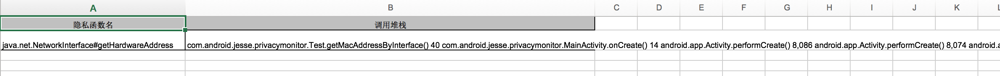
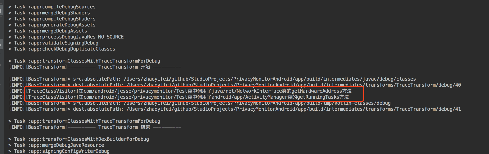

# PrivacyMonitorAndroid

Android 隐私合规检测方案，用于快速找到隐私api调用所在堆栈，解决Android隐私合规问题。通过gradle plugin + ASM技术来实现可配置范围的方法插桩来统计隐私api所调用的堆栈信息，并在本地Excel文件中提供友好的统计展示，方便排查隐私合规问题。

## 实现效果预览 



## 项目组成

1. **plugin:**   Gradle 插件，在隐私api调用所在方法执行编译期插桩，织入数据收集代码，便于后面数据的统计和处理。
2. **collect：** Android Library，隐私api的数据收集，统计和处理，并将整合的信息保存到本地Excel文件中。
3. **collect-noop：** Android Library，release包下依赖的是noop包，里面没有任何逻辑，只是collet项目中的壳方法，避免将collect中的代码带到线上，也不会增加线上包的大小。

## 快速使用

1. **在项目根目录的build.gradle 中添加:**

   ```groovy
   buildscript {
       repositories {
           maven { url 'https://jitpack.io' }
       }
       dependencies {
           classpath 'com.github.Jesse505.PrivacyMonitorAndroid:plugin:1.0.0'
       }
   }
   
   allprojects {
       repositories {
           maven { url 'https://jitpack.io' }
       }
   }
   ```

2. **在app的build.gradle 中添加**

   ```groovy
   apply plugin: 'com.android.jesse.privacy-monitor'
   privacyTrace {
       enable = true    //插件开关，建议上线前关闭
       logEnable = true //插桩日志开关
       traceConfigFile = "${project.projectDir}/privacyTraceConfig.txt"
   }
   
   dependencies {
       debugImplementation 'com.github.Jesse505.PrivacyMonitorAndroid:collect:1.0.0'
       releaseImplementation 'com.github.Jesse505.PrivacyMonitorAndroid:collect-noop:1.0.0'
   }
   ```

3. **在app module的根目录下创建一个名叫`privacyTraceConfig.txt`的配置文件，并在里面对插桩范围进行配置，下面是配置实例**

   ```java
   #配置需要统计的隐私的api
   -tracemethod java/net/NetworkInterface.getHardwareAddress
   -tracemethod android/app/ActivityManager.getRunningTasks
   #配置无需扫描插桩的包
   -keeppackage com/android/jesse/collect
   #配置无需扫描插桩的类
   -keepclass com/android/jesse/collect/PrivacyCollect
   ```

4. **在同意隐私协议政策后，调用PrivacyCollect.stopCollect()方法，然后Rebuild项目**

   可以看到如下build信息中的插桩日志

   

5. **运行app，同意隐私政策后把/storage/emulated/0/Android/data/com.android.jesse.privacymonitor/files/privacy_result.xls 文件导出，里面的内容就是预览显示的效果。**

